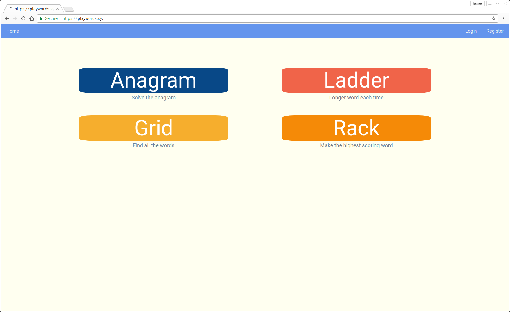
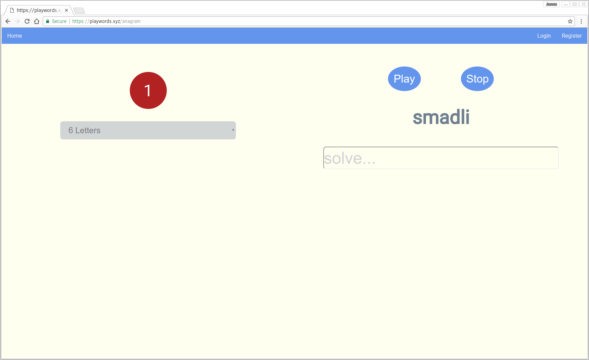

# playwords.xyz

Simple, anagram based wordgames.

## Anagram

An anagram 'gym', which supplies an endless series of scrambled words. Pick the length you want, or take whatever gets served up. Words are between 4 and 21 letters long.

## Ladder

The anagram gets longer each time. After each correct answer a new anagram is presented that is one letter longer.

## Grid

Find as many words as you can, including the nine-letter word, hidden in the grid.

## Rack

Make the highest scoring word you can from the rack of letters. Play against the 'perfection' of the computer. After each round the game will show you the best scoring word, or congratulate you for having found it!

